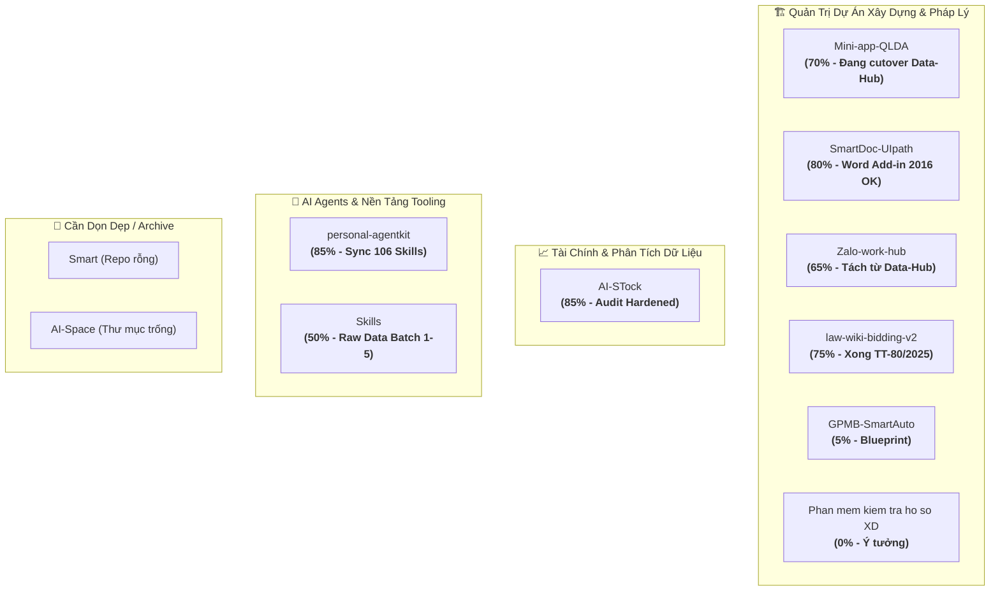

# 📊 BẢNG THEO DÕI TÌNH TRẠNG CÁC REPOSITORY (E:\App AI)
*Cập nhật tự động & đồng bộ: 04/09/2026*

---

## 🎯 Tổng Quan Hệ Sinh Thái Dự Án

Toàn bộ **11 thư mục/repository** tại `E:\App AI` được phân thành 3 nhóm chiến lược:

---

## 📌 Bảng Ma Trận Tình Trạng Tổng Hợp

| STT | Repository | Lĩnh Vực / Mục Đích | Stack Chính | Tiến Độ | Git Health | Trạng Thái & Khâu Dở Dang Chính | Ưu Tiên |
|:---:|:---|:---|:---|:---:|:---|:---|:---:|
| 1 | **Mini-app-QLDA** | Quản lý dự án đầu tư công, giải ngân vốn, vướng mắc (Web + Zalo Mini App) | FastAPI, TypeScript, ZaUI, Vite, PostgreSQL, Docker | **70%** | `main` ⚠️ 2 modified, 1 untracked | Đang cutover Data-Hub sang Mini-App; uncommitted: `data-hub-mini-cutover-plan.md`, untracked: `mini-data-hub-zalo-runbook.md`. Chờ official Zalo App ID để submit review. | **P0** 🔥 |
| 2 | **SmartDoc-UIpath** | Sinh văn bản tự động thay thế UiPath, Word Task Pane Add-in | FastAPI, python-docx, SQLite/Excel, Office.js | **80%** | `main` ⚠️ Behind remote 1 commit, 1 untracked docx | Word Add-in 2016 đã hoạt động trên máy local. Cần git pull commit `1f98597`, xử lý file template mới, hoàn thiện cơ chế xác thực bền vững cho mạng nội bộ (LAN readiness). | **P0** 🔥 |
| 3 | **Zalo-work-hub** | Bot nhận webhook Zalo OpenZCA, bóc tách việc, nhắc hẹn 4 mốc | FastAPI, SQLite WAL, Poetry, Streamlit, systemd | **65%** | `main` ✅ Clean, Sync remote | Đã tách độc lập từ Data-Hub (ADR-001). Cần deploy lên server Ubuntu thật (nơi có OpenZCA CLI), cấu hình định tuyến Zalo thật (`assignee_routes`) và test live. | **P1** ⚡ |
| 4 | **AI-STock** | Phân tích định lượng chứng khoán VN (CANSLIM, Minervini, Telegram Bot) | Python, Streamlit, SQLite, vnstock v4, GitHub Actions | **85%** | `master` ✅ Clean, Sync remote | Đã pass P0/P1 audit, atomic pipeline ingest->scorecard->alerts ok. Cần chạy cron ổn định thực tế trên GitHub Actions/local 24/7 và mở rộng bộ lọc ngành. | **P1** ⚡ |
| 5 | **personal-agentkit** | Hub quản lý và đồng bộ Skills/Agents/Rules cho Antigravity, Cursor, Codex | PowerShell, Markdown, JSON Schema | **85%** | `master` ⚠️ Chưa có remote Git | Đã hỗ trợ symlink 106 base skills, 3-tier skill-creator. Cần cấu hình GitHub remote repo để backup mã nguồn lên cloud và bổ sung skill chuyên môn xây dựng/pháp lý. | **P2** 📌 |
| 6 | **law-wiki-bidding-v2** | Knowledge base Luật Đấu thầu 2023, NĐ 214, TT 79, TT 80 | Markdown, Obsidian Vault, Python Ingest | **75%** | `main` ✅ Clean, Sync remote | Đã hoàn thành nạp 98 điều luật, 31 khái niệm, TT 79 & TT 80/2025. Phần dở dang: Chưa làm post-processing (cross-linking và tổng hợp so sánh quy trình), chưa có giao diện chat RAG. | **P2** 📌 |
| 7 | **Skills** | Kho lưu trữ thô 106 engineering skills & tài liệu hướng dẫn AI | JSON, Markdown, Text | **50%** | ❌ Không có Git | Dạng dữ liệu thô (BATCH 1-5). Cần trích xuất và chuyển đổi các kỹ năng hữu ích sang format chuẩn của `personal-agentkit/skills`. | **P3** ⏳ |
| 8 | **GPMB-SmartAuto** | Kế hoạch tự động hóa hồ sơ bồi thường, giải phóng mặt bằng | Chưa có code | **5%** | `main` ✅ Chỉ có 1 commit rỗng | Mới khởi tạo ý tưởng. Cần xác định phạm vi tài liệu (quyết định thu hồi, phương án bồi thường) để lên thiết kế kiến trúc theo mẫu của SmartDoc Studio. | **P3** ⏳ |
| 9 | **Phan mem kiem tra ho so XD** | Công cụ rà soát, kiểm tra hồ sơ dự toán, thiết kế, nghiệm thu XD | Trống | **0%** | ❌ Không có Git | Thư mục trống. Ý tưởng tiềm năng cho việc tích hợp AI rà soát lỗi hồ sơ thiết kế/dự toán. | **Ý tưởng** 💡 |
| 10 | **Smart** | Bản thử nghiệm cũ của SmartDoc | Chỉ có `.gitattributes` | **5%** | `main` | Bản cũ / stub. Đề xuất: Kiểm tra và xoá hoặc lưu trữ (archive) để tránh nhầm lẫn. | **Dọn dẹp** 🧹 |
| 11 | **AI-Space** | Workspace thử nghiệm AI chung | Trống | **0%** | ❌ Không có Git | Thư mục trống. Có thể dọn dẹp hoặc dùng làm nơi thử nghiệm scratchpad. | **Dọn dẹp** 🧹 |

---

## 🔍 Chi Tiết Tình Trạng Từng Repository & Kế Hoạch Hành Động

---

### 1. 🏢 Mini-app-QLDA (Dự án Đầu tư công - Zalo Mini App & Web)
* **Đường dẫn**: `E:\App AI\Mini-app-QLDA`
* **Trọng tâm hiện tại**: Đang tích hợp cổng dữ liệu Data-Hub vào Zalo Mini App và quản trị giải ngân vốn đầu tư công.
* **Tình trạng chi tiết**:
  - ✅ **Đã hoàn thành**: Architecture monorepo, FastAPI backend `/api/v1`, Web view responsive, ZaUI components, Phase 4 Staging Baseline PASS.
  - 🔄 **Đang làm dở**:
    - File `docs/data-hub-mini-cutover-plan.md` đang sửa đổi dở dang (vừa bổ sung ghi chú test temporary tunnel ngày 22/08/2026).
    - File mới tạo chưa commit: `docs/mini-data-hub-zalo-runbook.md`.
    - Tiến độ Phase 2 (Durable backend & identity) và Phase 5 (Zalo Pilot submission).
  - 🛑 **Điểm nghẽn (Blockers)**:
    - Thiếu Zalo Official Account App Credentials để submit review Mini App chính thức lên Zalo.
    - Hiện đang dùng tunnel tạm thời để smoke test chi tiết giải ngân dự án.
* **Hành động tiếp theo đề xuất (Next Actions)**:
  1. Commit các file tài liệu vận hành và cutover plan đang sửa dở (`git add . && git commit -m "docs: sync cutover plan and runbook"`).
  2. Ổn định API Gateway giữa Data-Hub và Mini-app.
  3. Chuẩn bị hồ sơ đăng ký Zalo Mini App chính thức khi có App ID.

---

### 2. 📄 SmartDoc-UIpath (SmartDoc Studio - Sinh văn bản tự động)
* **Đường dẫn**: `E:\App AI\SmartDoc-UIpath` *(Workspace hiện tại)*
* **Trọng tâm hiện tại**: Tự động hóa sinh hồ sơ, quyết định, biểu mẫu dự án đầu tư xây dựng, thay thế UiPath trước đây.
* **Tình trạng chi tiết**:
  - ✅ **Đã hoàn thành**: Full pytest suite 56/56 test passed. Cơ chế SQLite ưu tiên + Excel fallback. Word Web Task Pane Add-in 2016 đã chạy trên Word local qua share `\\DESKTOP-OM8BMBB\word_addin`.
  - 🔄 **Đang làm dở**:
    - Nhánh local đang bị sau `origin/main` 1 commit (`1f98597` - "update import file").
    - Có 1 template văn bản thực tế chưa commit: `samples/templates/TB phân công nhiệm vụ QLDA.GS Ke Ha trung.docx`.
  - 🛑 **Điểm nghẽn & Backlog**:
    - Chưa có xác thực bảo mật và manifest bền vững khi triển khai ra mạng LAN (hiện chỉ chạy an toàn trên localhost).
    - Add-in Word mới hỗ trợ danh mục và chèn placeholder, chưa tích hợp scan/render trực tiếp trong Word.
* **Hành động tiếp theo đề xuất (Next Actions)**:
  1. Chạy `git pull` để cập nhật commit mới nhất từ `origin/main`.
  2. Kiểm tra template `TB phân công nhiệm vụ...` để bổ sung placeholder và lưu vào catalog.
  3. Bổ sung các mẫu biểu mẫu phổ biến của Ban QLDA vào cơ sở dữ liệu SQLite.

---

### 3. 💬 Zalo-work-hub (Quản lý công việc & Nhắc lịch qua Zalo)
* **Đường dẫn**: `E:\App AI\Zalo-work-hub`
* **Trọng tâm hiện tại**: Bot tự động tiếp nhận tin nhắn từ Zalo OpenZCA, bóc tách đầu việc, lên lịch nhắc 4 mốc (trước 1 ngày, đúng hạn, quá hạn 1 ngày, quá hạn 2 ngày) và gửi tin nhắn cảnh báo.
* **Tình trạng chi tiết**:
  - ✅ **Đã hoàn thành**: Kiến trúc tách rời hoàn toàn từ Data-Hub (ADR-001). Cấu trúc mã nguồn FastAPI Webhook Ingress, Rule-based Parser tiếng Việt, SQLite WAL, Outbox Worker Lease Lock, Streamlit Admin.
  - 🔄 **Đang làm dở**: Mới ở commit khởi tạo (`Initial commit`), chưa chạy thử nghiệm thực tế với bot Zalo thật.
  - 🛑 **Điểm nghẽn**:
    - Yêu cầu server Ubuntu có cài đặt OpenZCA CLI để gửi tin Zalo.
    - Cần danh bạ mapping giữa tên người phụ trách (`@assignee`) và Zalo User ID/Group ID thật (`assignee_routes`).
* **Hành động tiếp theo đề xuất (Next Actions)**:
  1. Đồng bộ mã nguồn lên server Ubuntu.
  2. Thiết lập 3 systemd services (`zalo-api`, `zalo-worker`, `zalo-dashboard`).
  3. Nạp danh mục nhân sự và nhóm Zalo phòng ban vào bảng `assignee_routes`.

---

### 4. 📈 AI-STock (VN Stock Intelligence Hub)
* **Đường dẫn**: `E:\App AI\AI-STock`
* **Trọng tâm hiện tại**: Phân tích kỹ thuật định lượng (CANSLIM, Minervini, Markowitz) và cảnh báo điểm mua/bán qua Telegram tự động.
* **Tình trạng chi tiết**:
  - ✅ **Đã hoàn thành**: Production Audit Hardened v0.5.1. Đã fix 5 lỗi nghiêm trọng (BUG-001 đến BUG-005): rate limit vnstock, deduplicate tin Telegram, chống overdraw sổ cái tiền mặt, xử lý triệt để auto-seed trong live mode, atomic GitHub Actions workflow.
  - 🔄 **Đang làm dở**: Đang chạy trên nhánh `master`. Tích hợp vnstock v4 community key với rate limit 1.15s.
* **Hành động tiếp theo đề xuất (Next Actions)**:
  1. Giám sát độ ổn định của workflow GitHub Actions chạy 15:05 ICT mỗi ngày.
  2. Tinh chỉnh bộ lọc cổ phiếu để bổ sung thêm các nhóm ngành tiềm năng.

---

### 5. 🛠️ personal-agentkit (Quản lý AI Skills & Agents)
* **Đường dẫn**: `E:\App AI\personal-agentkit`
* **Trọng tâm hiện tại**: Đồng bộ bộ quy tắc (rules), kỹ năng (skills) và agent personas sang các công cụ AI (Google Antigravity, Cursor, Claude Code, OpenAI Codex).
* **Tình trạng chi tiết**:
  - ✅ **Đã hoàn thành**: Script `sync.ps1` hỗ trợ symlink/junctions cho 106 base skills; skill-creator chuẩn 3-Tier.
  - 🔄 **Đang làm dở**: Chưa có Remote Git repository (mới chỉ commit cục bộ).
* **Hành động tiếp theo đề xuất (Next Actions)**:
  1. Tạo private repository trên GitHub và đẩy code lên: `git remote add origin ... && git push -u origin master`.
  2. Xây dựng thêm các kỹ năng nghiệp vụ chuyên biệt: `skill-kiem-tra-du-toan`, `skill-ra-soat-phap-ly-dau-thau`.

---

### 6. ⚖️ law-wiki-bidding-v2 (Cơ sở tri thức Luật Đấu Thầu)
* **Đường dẫn**: `E:\App AI\law-wiki-bidding-v2`
* **Trọng tâm hiện tại**: Hệ thống hóa toàn bộ văn bản pháp lý về Đấu thầu (Luật Đấu thầu 2023, NĐ 214/2025, TT 79/2025, TT 80/2025) theo mô hình LLM Wiki Graph.
* **Tình trạng chi tiết**:
  - ✅ **Đã hoàn thành**: 98 điều luật, 10 chương, 35 concepts pháp lý, liên kết 3 tầng (Luật ↔ NĐ ↔ Thông tư). Đã nạp xong Thông tư 80/2025/TT-BTC ngày 14/05/2026.
  - 🔄 **Đang làm dở**: Chưa thực hiện khâu tổng hợp (syntheses) so sánh các quy trình lựa chọn nhà thầu; chưa có giao diện hỏi đáp AI trực tiếp.
* **Hành động tiếp theo đề xuất (Next Actions)**:
  1. Viết các bài tổng hợp quy trình: Chỉ định thầu rút gọn, Chào hàng cạnh tranh, Đấu thầu rộng rãi qua mạng.
  2. Kết nối tri thức này vào `personal-agentkit` hoặc xây dựng endpoint MCP server để các trợ lý AI tra cứu điều luật trực tiếp khi soạn thảo văn bản.

---

### 7. 💡 Các Dự Án Cần Khởi Động / Dọn Dẹp
1. **`GPMB-SmartAuto`**:
   - Khởi tạo file `README.md` mô tả bài toán: Tự động hóa trích lục hồ sơ địa chính, lập biên bản kiểm đếm, tính toán phương án bồi thường hỗ trợ tái định cư.
2. **`Phan mem kiem tra ho so XD`**:
   - Xác định rõ công nghệ (Python Streamlit hoặc FastAPI + React) để kiểm tra các đầu mục: Hồ sơ thiết kế bản vẽ thi công, bảng tính dự toán xây dựng, hồ sơ nghiệm thu thanh quyết toán.
3. **`Smart` & `AI-Space`**:
   - Xoá hoặc di chuyển vào thư mục `_archive/` để giữ không gian làm việc `E:\App AI` gọn gàng, tập trung.

---

## ⚡ Hướng Dẫn Vận Hành & Khởi Động Nhanh

| Dự Án | Lệnh Chạy Kiểm Thử / Vận Hành Cục Bộ |
|:---|:---|
| **Mini-app-QLDA** | Backend: `poetry run uvicorn app.main:app --reload` Frontend: `pnpm --filter @qlda/web dev` |
| **SmartDoc-UIpath** | Backend: `poetry run uvicorn app.main:app --port 8000 --reload` Test: `poetry run pytest` |
| **Zalo-work-hub** | API: `poetry run uvicorn app.api.server:app --port 8080 --reload` Dashboard: `poetry run streamlit run app/dashboard/dashboard_app.py` |
| **AI-STock** | App: `streamlit run app.py` Ingest: `python scripts/ingest_real_market_data.py` Test: `pytest` |
| **personal-agentkit** | Đồng bộ: `.\sync.ps1` (Chạy PowerShell với quyền Administrator/Developer Mode) |
| **law-wiki-bidding-v2** | Mở thư mục `wiki/` bằng Obsidian Vault |

---
*Bảng theo dõi này được duy trì để hỗ trợ điều phối toàn diện các ứng dụng AI & Tự động hóa.*
